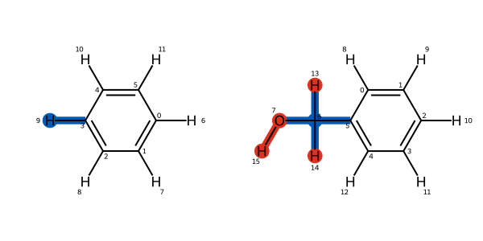

<p align="center">
    
    <!--  -->
</p>

Kartograf: A 3D Atom Graph Mapper
==================================

[//]: # (Badges)
[](https://openfree.energy/)
[](https://github.com/OpenFreeEnergy/kartograf/actions/workflows/ci.yaml)
[](https://codecov.io/gh/OpenFreeEnergy/kartograf)
[](https://kartograf.readthedocs.io/en/latest/?badge=latest)

[](https://pypi.org/project/kartograf/)
[](https://anaconda.org/conda-forge/kartograf)


Kartograf offers a geometric atom mapper approach, that allows to map a given set of ligand coordinates. (can be used for hybrid topology  RBFE calculations)
This package can be used standalone, or from the OpenFE environment.

**More will be here soon!**

## Usage
```python3
from rdkit import Chem
from kartograf.atom_align import align_mol_shape
from kartograf import KartografAtomMapper, SmallMoleculeComponent

#Preprocessing from Smiles - Here you can add your Input!
# Generate Data: START
smiles = ["c1ccccc1", "c1ccccc1(CO)"]
rdmols = [Chem.MolFromSmiles(s) for s in smiles]
rdmols = [Chem.AddHs(m, addCoords=True) for m in rdmols]
[Chem.rdDistGeom.EmbedMolecule(m, useRandomCoords=False, randomSeed = 0) for m in rdmols]
# Generate Data: END

# Build Small Molecule Components
molA, molB = [SmallMoleculeComponent.from_rdkit(m) for m in rdmols]

# Align the mols first - this might not needed, depends on input.
a_molB = align_mol_shape(molB, ref_mol=molA)


# Build Kartograf Atom Mapper
mapper = KartografAtomMapper(atom_map_hydrogens=True)

# Get Mapping
kartograf_mapping = next(mapper.suggest_mappings(molA, a_molB))

kartograf_mapping
```


## Installation
you can install Kartograf via the package manager of your choice:

```shell
pip install kartograf
```

```shell
conda install -c conda-forge kartograf
```

Or use Kartograf from the OpenFE Environment (soon).

For Developing Kartograf, you might want to use this approach:

```shell
git clone https://github.com/OpenFreeEnergy/kartograf.git

cd kartograf
conda env create -f environment.yml

conda activate kartograf
pip install .

```
## References


