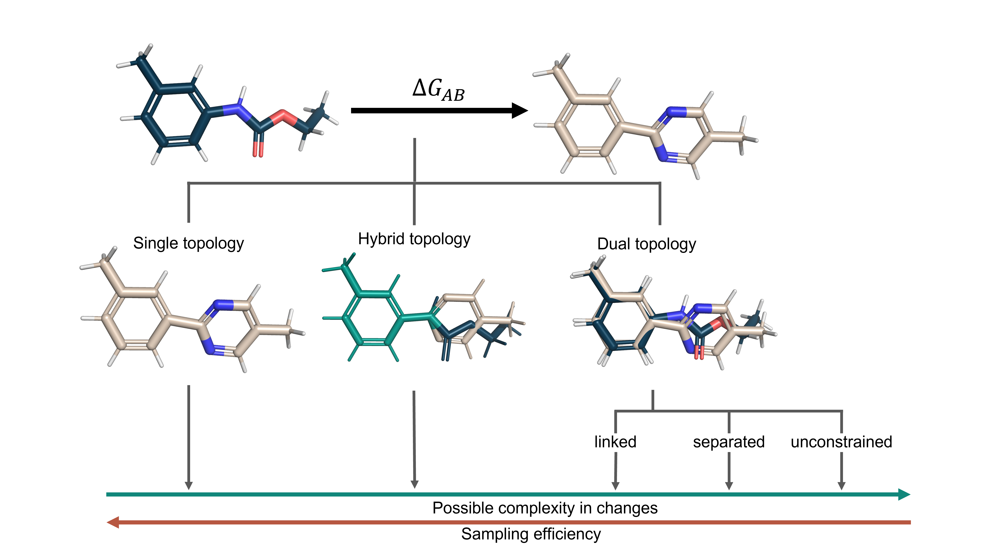

=======================================
Application in Free Energy Calculations
=======================================

In recent literature, many ways have shown how a system can be represented
during a free energy calculation. Here is a small Taxonomy that tries to
capture them and show benefits and disadvantages (more you can find in
[1]_ [2]_):

The hybrid topology approach and the single topology approach depend heavily
on atom mappings, The mappings are used to find the shared core region of the
molecules, such that the atoms part of this region can be represented as one.
The single topology approach tries to maximize the number of mapped
atoms, where the hybrid topology approach only maps one shared region of
the molecules and represents the remaining atom coordinates independent of
each other.

The usage of Kartograf's atom mapper for this application can be found in the
turorial: :doc:`/tutorial/mapping_tutorial`.

.. [1] Ries, B.; Rieder, S.; Rhiner, C.; Hünenberger, P. H.; Riniker, S. - RestraintMaker: a graph-based approach to select distance restraints in free-energy calculations with dual topology. J Comput Aided Mol Des 36, 175–192 (2022). https://doi.org/10.1007/s10822-022-00445-6.
.. [2] Ries, B.; Alibay, I.; Swenson, D. W. H; Baumann, H. M.; Henry, M. M.; Eastwood, J. R. B.; Gowers, R. J. - Kartograf: An Accurate Geometry-Based Atom Mapper for Hybrid Topology Relative Free Energy Calculations, Chemrxiv (2023) https://10.26434/chemrxiv-2023-0n1pq

