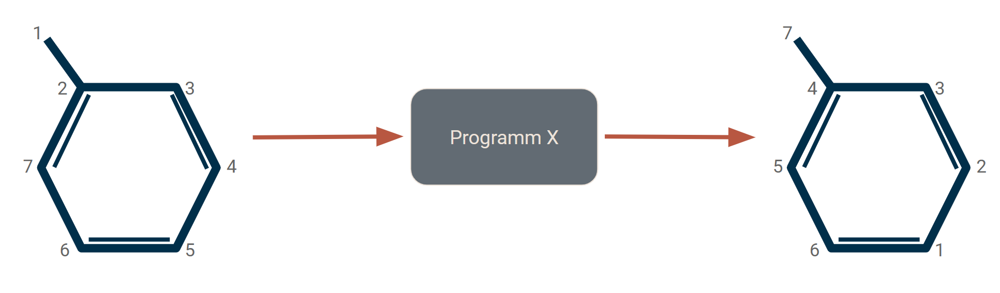

=======================================
Application for Reindexing Problem
=======================================

Atom indices are important properties of Molecules in any insilico approach.
However ti still sometimes happens, that there are pieces of code, that
reindex the atoms of a molecule like in the following example:

If the molccule has a given conformation, which stays unchanged, Kartograf's
atom mapper can be usde to adress this problem very easily and precise!

You can use the code from the mapping tutorial in order to solve this problem:
:doc:`/tutorial/mapping_tutorial`.
