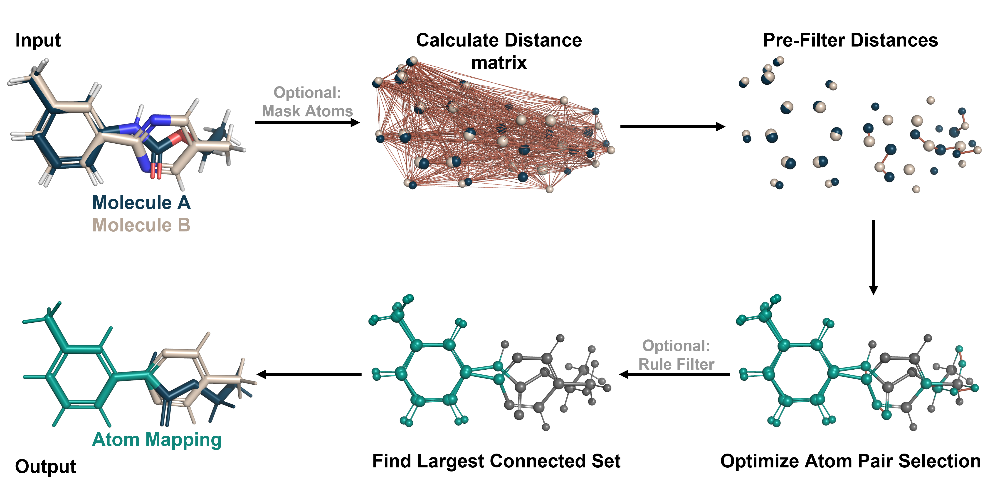

===============================
Atom Mapping
===============================

Atom mappings can have a large variety of different use cases. The general goal of atom mapping is to find an
assignment between two sets of atoms based on a certain motivation. A very common approach is to find an
assignment of atoms, between two molecules, which are considered similar/equal
leading to an MCS estimation.

For finding such atom mappings multiple different approaches were described
in the literature. One is to use 2D isomorphic graph problem-solving in order to
estimate the MCS. Alternatively one can use the 3D geometry information of
the atoms in order to find such a mapping, like Kartograf does with its atom
mapper. Kartograf assumes that the input coordinates of the molecules are
highly overlapping due to prior alignment or modeling approaches before the
mapping stage is performed. This allows Kartograf to find very efficiently an
atom mapping with a minimal atom displacement.

In the case of classical atom mappings for hybrid topology free energy
calculations, a core region of the molecules is required. That region is
actually, a sub-space of the actual atom mapping and it ensures, that all
mapped atoms are connected via covalent bonds in their original molecule, as
this might lead to problems in the sampling during the simulations
(communicating mapped regions).

Approach:

Atom Mapping Filters
---------------------

Additionally, rules can be applied during Kartograf's mapping algorithm,
such that for example hydrogens are only mapped on hydrogens or no ring
breakage occurs. Such rules might be necessary in order to
ensure sampling of physically relevant configurations or serve other purposes. You can find more information and
examples in the :ref:`mapping filters tutorial <custom-filter-label>`.

