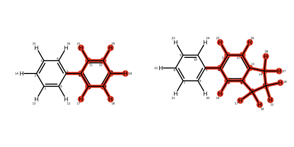

Atom Mapping and Fused Rings
-----------------------------

Creating atom mappings between two ring systems where only one is fused can be difficult as there are two possible
options. ``Kartograf`` is able to create both possible mappings and the user can select which via the use of the
``allow_partial_fused_rings`` flag. In this short tutorial we will demonstrate how to use this flag to generate the desired mappings
for this special case. First, lets start by creating our example molecules and aligning them. We will be following the
:ref:`mapping tutorial <mapping_tutorial>` for this part.

.. code-block::

    from rdkit import Chem
    from kartograf import SmallMoleculeComponent
    from kartograf.atom_aligner import align_mol_shape

    # Preprocessing from Smiles - Here you can add your Input!
    smiles = ["c1ccccc1-c2ccccc2", "C1Cc2cc(-c3ccccc3)ccc2C1"]
    rdmols = [Chem.MolFromSmiles(s) for s in smiles]
    rdmols = [Chem.AddHs(m, addCoords=True) for m in rdmols]
    [Chem.rdDistGeom.EmbedMolecule(m, useRandomCoords=False, randomSeed = 0) for m in rdmols]

    # Build Small Molecule Components
    molA, molB = [SmallMoleculeComponent.from_rdkit(m) for m in rdmols]

    # Align the mols first
    a_molB = align_mol_shape(molB, ref_mol=molA)

The first type of mapping keeps the common rings fixed and grows the second fused ring using dummy atoms.
This approach would involve transforming fewer atoms but can lead to systematic errors in the calculated free energies [1]_.
This is the default behaviour of the ``KartografAtomMapper``:

.. code-block::

    from kartograf import KartografAtomMapper
    mapper = KartografAtomMapper()
    # Get Mapping
    kartograf_mapping = next(mapper.suggest_mappings(molA, a_molB))
    kartograf_mapping

The second option considers the entire fused ring system as a unique set of atoms and is normally preferred however,
this generally involves a larger alchemical region resulting in a larger statistical error and may require more sampling
to converge the results to sufficient accuracy. This type of mapping can be created by using ``allow_partial_fused_rings=False``:

.. code-block::

    fused_mapper = KartografAtomMapper(allow_partial_fused_rings=False)
    # Get Mapping
    kartograf_mapping = next(fused_mapper.suggest_mappings(molA, a_molB))
    kartograf_mapping

References
~~~~~~~~~~

.. [1] Mey, A.S., Allen, B.K., Macdonald, H.E.B., Chodera, J.D., Hahn, D.F., Kuhn, M., Michel, J., Mobley, D.L., Naden, L.N., Prasad, S. and Rizzi, A., 2020. Best practices for alchemical free energy calculations [article v1. 0]. Living journal of computational molecular science, 2(1) https://doi.org/10.33011/livecoms.2.1.18378