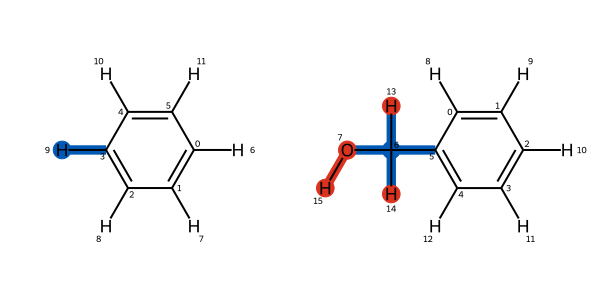

.. _mapping_tutorial:

Atom Mapping of two Molecules for finding a common core region
---------------------------------------------------------------

This is a short tutorial trying to give a hand on how to work with Kartograf.
First, the input is generated from two SMILES with RDKit. We will add all
hydrogens and generate both molecules a 3D conformation with RDKit.
Afterward, the molecules are transformed into ``SmallMoleculeComponent``, which
is the entrance into Kartograf and the OpenFE world::

    from rdkit import Chem
    from kartograf import SmallMoleculeComponent

    # Preprocessing from Smiles - Here you can add your Input!
    smiles = ["c1ccccc1", "c1ccccc1(CO)"]
    rdmols = [Chem.MolFromSmiles(s) for s in smiles]
    rdmols = [Chem.AddHs(m, addCoords=True) for m in rdmols]
    [Chem.rdDistGeom.EmbedMolecule(m, useRandomCoords=False, randomSeed = 0) for m in rdmols]

    # Build Small Molecule Components
    molA, molB = [SmallMoleculeComponent.from_rdkit(m) for m in rdmols]

Next, we need to make sure, that the molecules are well aligned, as this is
one of the core assumptions of Kartograf's atom mapper in order to find a
good mapping. Here we use a helper function from Kartograf`s atom aligner
functions, that aligns the molecules based on their shape::

    from kartograf.atom_aligner import align_mol_shape
    # Align the mols first - this might not needed, depends on input.
    a_molB = align_mol_shape(molB, ref_mol=molA)

Finally, we will generate the atom mapping. Here we decide to map hydrogens as
well as heavy atoms (this is a default). As input, we give the aligned
``SmallMoleculeComponents``
and we will retrieve an ``AtomMapping`` from the mapper, that contains both
components and the atom mapping from one to the other component::

    from kartograf import KartografAtomMapper
    # Build Kartograf Atom Mapper
    mapper = KartografAtomMapper(atom_map_hydrogens=True)

    # Get Mapping
    kartograf_mapping = next(mapper.suggest_mappings(molA, a_molB))
    print(kartograf_mapping.componentA_to_componentB) #print mapping
    kartograf_mapping

If this code block is executed in a Jupyter Notebook, the cell will return a 2D
visualization of the mapping:

Note that Kartograf does first solve the geometry problem, by finding  atoms
close to each other for the mapping. Next, it will apply a set of default
rules, that will remove mappings, that cause a so-called ``ring-break``, a
``ring-size change``, and a ``ring-flexibility change``. This default behavior can
be turned off and/or customized to personal needs see :ref:`the filtering tutorial <custom-filter-label>`.

Additionally, we could assess the quality of our mapping, there are several
metrics in Kartograf that can be used to investigate the mapping. Here we are
going to use the :class:`.MappingRMSDScorer`, which gives insight into how far the atoms
need to travel from one state to the other, if they are mapped onto each
other::

    from kartograf.mapping_metrics import MappingRMSDScorer

    # Score Mapping
    rmsd_scorer = MappingRMSDScorer()
    score = rmsd_scorer(mapping=atom_mapping)
    print(f"RMSD Score: {score}")

This will print the calculated score.
