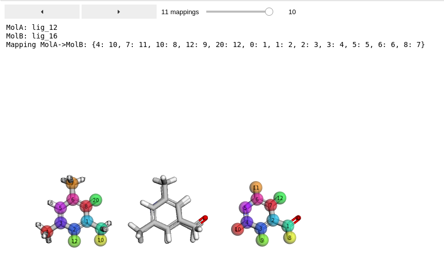

3D Visualization Widget
------------------------

If you want to quickly investigate many mappings in 3D, we recommend using
our Jupyter Notebook widget, which comes with a slider and an interactive 3D
visualization::

    from kartograf.utils.mapping_visualization_widget import display_mappings_3d

    # here a list of three mappings
    mappings: List[AtomMappings] = [mappingA, mappingB, mappingZ] #pseudo code

    display_mappings_3d(mappings)

Have fun!
